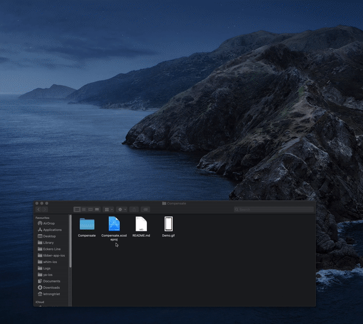

# Compensate

## Application architecture
Application is built base on MVVM + Dependencies Injection architecture to respect SOLID principle

### ViewModel 
- Handles data (talking to the api)
- Observes app and server events.
- Business logic
- Typically comes as a together with a ViewController
- Communicated "back" to the Coordinator using the delegate pattern.
### View
- Typically a UIViewController
- Handles the view
- Has a reference to the ViewModel and observes it.
- Informs the ViewModel about user interactions (buttons etc. are clicked)
- Typically comes as pair together the a ViewModel
- Typically each screen in the app has it's own ViewController (and ViewModel)
### Model
- Just data. No logic.
- Basically the api and the models passed to/from the api.
- The api does the data caching

## How to run application
1. Clone this repo
2. Run `Compensate.xcodeproj`
3. Choose your preferred simulator
4. Run application
5. Enjoy!

## Video tutorial for running application

## Demo

